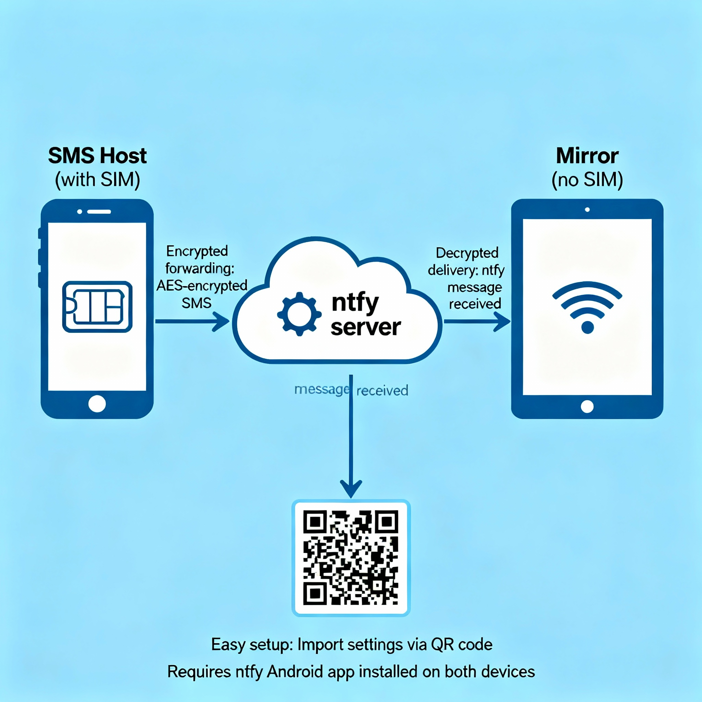

# Messages Mirror

This repository is a fork of the [FossifyOrg/Messages](https://github.com/FossifyOrg/Messages) Android app
which provides an easy and quick way of managing SMS and MMS messages.

This fork introduces a privacy-focused mirroring system designed to run on two devices:

- SMS Host (with SIM): Receives SMS messages and forwards them via a [ntfy](https://ntfy.sh) server.
- Mirror (no SIM required): Receives the forwarded messages and displays them locally.

Why mirror? Privacy. You can keep the SIM and phone number on a single device that remains in a
fixed location, while still reading SMS on a separate "Mirror" device. The Mirror can use a
privacy-focused eSIM or Wi‑Fi for internet access, reducing the risk of location tracking tied to your
phone number on the device you carry.

## How it works

- Encrypted forwarding: Incoming SMS messages on the Host are serialized and AES-encrypted, then sent to a ntfy
  server using a topic you control.
- Delivery on Mirror: The Mirror listens for ntfy messages for the configured topic, decrypts the  
  payload, and displays the message in the app for viewing.
- Easy setup and sharing: Configure Device Mode (Host or Mirror), Topic, and Encryption Key and share
  or import settings via QR code.

## Requirements

The [ntfy Android app](https://docs.ntfy.sh/#step-1-get-the-app) must be installed for message transport on both devices.
The Messages Mirror app communicates with the ntfy app on the device with the ntfy app
sending and receiving data over the internet. The Messages Mirror app itself does not require internet access
for mirroring, as all network traffic is handled by the ntfy app.

## Quick start

1. Install the [ntfy Android app](https://docs.ntfy.sh/subscribe/phone/#subscribe-from-your-phone) on
   both devices.
2. Install the app on both devices.
3. On the device with the SIM, open Settings → Mirror and:
    - Enable Mirror
    - Set Device Mode to “SMS Host”
    - Set a Topic and Encryption Key (you can generate both)
    - Subscribe to the Topic in the [ntfy app](https://docs.ntfy.sh/subscribe/phone/#overview)
4. On the second device (no SIM), open Settings → Mirror and:
    - Enable Mirror
    - Set Device Mode to “Mirror”
    - Scan the QR code on the SMS Host or manually enter the same Topic and Key
    - Subscribe to the Topic in the [ntfy app](https://docs.ntfy.sh/subscribe/phone/#overview)
5. When SMS messages arrive at the Host, they’ll be forwarded to the Mirror over ntfy and appear locally.

## Security Notes

- Messages are encrypted with AES before being sent via ntfy.
- The encryption key is generated and stored locally on each device. **If lost, messages cannot be decrypted.**
- The ntfy server handles transport but does not decrypt messages. For maximum privacy, consider [self-hosting ntfy](https://docs.ntfy.sh/install/).

## Troubleshooting

- **Messages not appearing?**  
  → Ensure both devices are subscribed to the same ntfy topic.  
  → Verify the encryption key is identical on both devices.  
  → Check that the ntfy app is running and has internet access.
